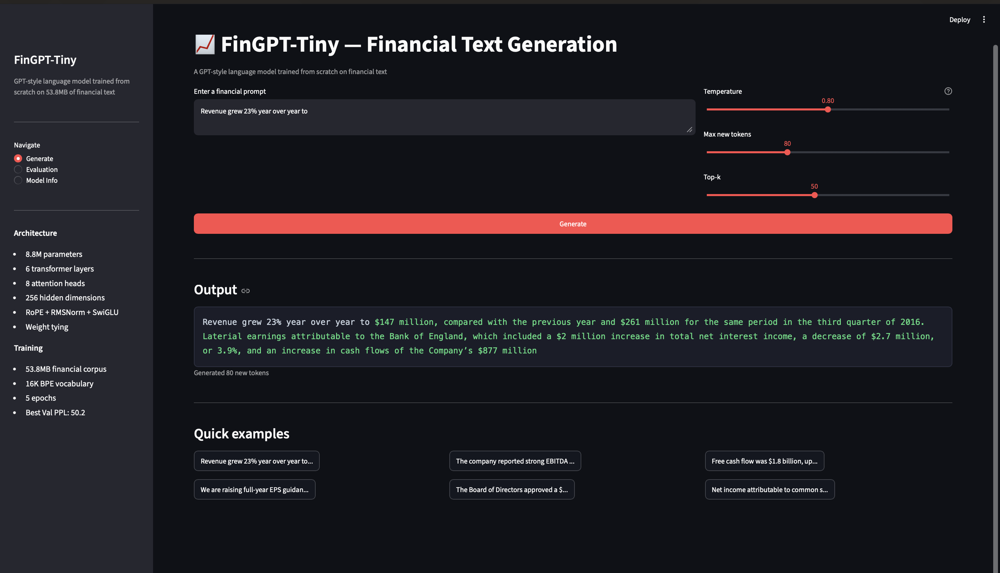
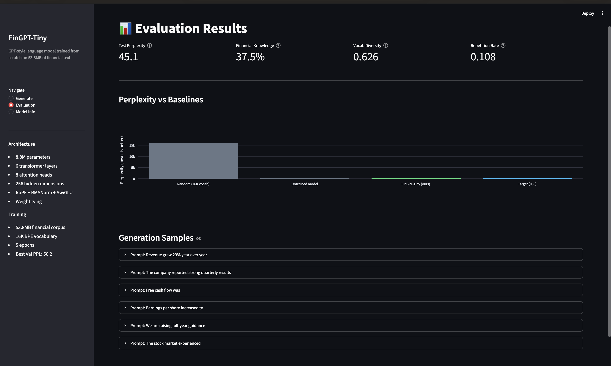

# FinGPT-Tiny

A GPT-style language model trained **entirely from scratch** in PyTorch on 53.8MB of financial text. No pretrained weights. No HuggingFace trainer. Every component built from scratch.

**8.8M parameters · 50.2 best val perplexity · Trained on MacBook M-series for $0**



---

## What it does

FinGPT-Tiny generates coherent financial language — earnings call sentences, analyst commentary, market descriptions. It learned financial vocabulary, syntax, and domain patterns from raw text alone.

**Sample generations:**

```
Prompt:  Revenue grew 23% year over year to
Output:  Revenue grew 23% year over year to $4.9 billion, or $2.11 a share.
         "We were thrilled to welcome Steve at the time of...

Prompt:  The company reported
Output:  The company reported a statement on Wednesday. The company will
         report fourth-quarter results on Jan. 2, 2018...

Prompt:  Free cash flow was
Output:  Free cash flow was the most effective tax rate for the S&P 500's...
```

---

## Architecture

```
Input: token ids (batch, seq_len=256)
  ↓
Token Embedding (16,000 vocab → 256 dims)     # trained from scratch
  ↓
Transformer Block × 6
  ├─ RMSNorm(256)                              # stable normalisation
  ├─ CausalSelfAttention (8 heads, d_k=32)
  │    ├─ Q, K, V projections (no bias)
  │    ├─ Rotary Positional Encoding (RoPE)   # same as Llama, GPT-NeoX
  │    └─ Causal mask — no future peeking
  ├─ Residual
  ├─ RMSNorm(256)
  └─ SwiGLU FeedForward (256 → 683 → 256)    # same as PaLM, Llama
  ↓
Final RMSNorm
  ↓
LM Head (256 → 16,000)                        # weight-tied with embedding
  ↓
Output: logits (batch, seq_len, 16,000)
```

---

## Results

| Metric | Value |
|---|---|
| Best Val Perplexity | 50.2 |
| Best Val Loss | 3.916 |
| Total Steps | 7,895 |
| Parameters | 8,819,456 |
| Training Corpus | 53.8 MB |
| Vocabulary | 16,000 BPE tokens |
| Hardware | Apple M-series MPS |
| Training Cost | $0 |

---

## Getting Started

```bash
git clone https://github.com/Jk180603/fingpt-tiny
cd fingpt-tiny
python -m venv venv
source venv/bin/activate
pip install -r requirements.txt
```

**Download data and train tokenizer:**
```bash
python data/download.py
python tokenizer/train_tokenizer.py
```

**Train the model:**
```bash
python model/pretrain.py
```

**Run evaluation:**
```bash
python evaluation/evaluate.py
```

**Start API:**
```bash
uvicorn serving.main:app --reload
```

**Start dashboard:**
```bash
streamlit run dashboard/app.py
```

---

## Docker

```bash
# API only
docker-compose up api

# API + Dashboard
docker-compose up

# Run evaluation
docker-compose --profile eval run evaluate
```

---

## API

| Endpoint | Method | Description |
|---|---|---|
| `/` | GET | Model info and eval results |
| `/generate` | POST | Generate text from prompt |
| `/health` | GET | Health check |
| `/vocab-size` | GET | Vocabulary size |

**Example:**
```bash
curl -X POST http://localhost:8000/generate \
  -H "Content-Type: application/json" \
  -d '{"prompt": "Revenue grew", "max_new_tokens": 80, "temperature": 0.8}'
```

---

## Evaluation

Four evaluation dimensions:

1. **Perplexity** on held-out financial test set
2. **Financial knowledge** — fill-in-the-blank accuracy on domain terms
3. **Vocabulary diversity** — unique token ratio in generated text
4. **Repetition rate** — bigram repetition in generated text

```bash
python evaluation/evaluate.py
```

---

## Project Structure

```
fingpt-tiny/
├── data/
│   ├── download.py          # corpus collection (5 sources, 53.8MB)
│   └── get_real_transcripts.py
├── tokenizer/
│   └── train_tokenizer.py   # BPE from scratch on financial text
├── model/
│   ├── fingpt.py            # GPT architecture: RoPE + RMSNorm + SwiGLU
│   └── pretrain.py          # training loop with resume + MLflow
├── evaluation/
│   └── evaluate.py          # perplexity + knowledge + quality metrics
├── serving/
│   └── main.py              # FastAPI inference API
├── dashboard/
│   └── app.py               # Streamlit UI
├── Dockerfile
├── docker-compose.yml
└── requirements.txt
```

---

## Technical notes

- **BPE tokenizer** trained directly on financial corpus — learns domain subwords like `ĠEBITDA`, `ĠEPS`, `Ġguidance` as single tokens
- **Weight tying** between token embedding and LM head — reduces parameters and improves training stability (same as GPT-2, Llama)
- **Checkpoint resume** — training can be interrupted and resumed from any saved step
- **Cosine LR schedule** with linear warmup — matches Chinchilla and Llama training recipes

---

Built by [Jay Khakhar](https://github.com/Jk180603) · MSc AI @ BTU Cottbus-Senftenberg
